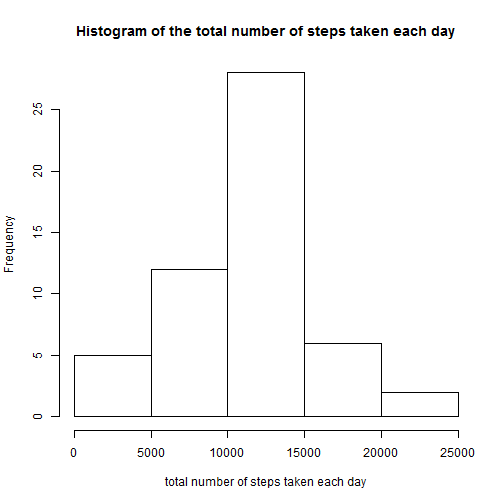
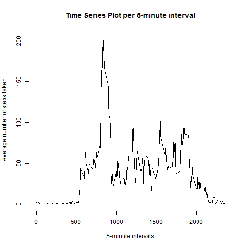
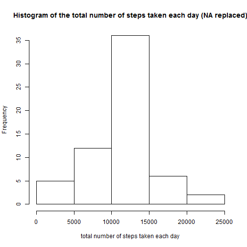
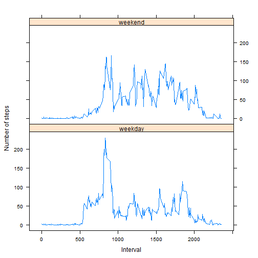

Reproducible Research - Peer Assessment 1
========================================================

Created by: Ankush Jindal
Created on: 13/12/14

Loading and preprocessing the data
-------------------------
The report requires `activity.csv` to be present in the same folder as `PA1_template.Rmd`. 

### Loading the data

```r
df <- read.csv("activity.csv")

```


### Preprocessing the data

```r
df$date <- as.Date(df$date, format = "%Y-%m-%d")  # convert date to column with date type

# create dataframe with total steps per day
df.day <- aggregate(df$steps, by = list(df$date), sum)
names(df.day)[1] <- "day"
names(df.day)[2] <- "steps"

# create dataframe with total steps per interval
df.interval <- aggregate(df$steps, by = list(df$interval), sum, na.rm = TRUE, 
    na.action = NULL)
names(df.interval)[1] <- "interval"
names(df.interval)[2] <- "steps"

# create dataframe with mean steps per interval
df.mean.interval <- aggregate(df$steps, by = list(df$interval), mean, na.rm = TRUE, 
    na.action = NULL)
names(df.mean.interval)[1] <- "interval"
names(df.mean.interval)[2] <- "mean.steps"

```


What is mean total number of steps taken per day?
-------------------------

### Histogram of the total number of steps taken each day

```r

hist(df.day$steps, main = "Histogram of the total number of steps taken each day", 
    xlab = "total number of steps taken each day")
```

 


### The mean and median total number of steps taken per day

Mean number of steps per day:

```r
mean(df.day$steps, na.rm = TRUE)
```

```
## [1] 10766
```

Median number of steps per day:

```r
median(df.day$steps, na.rm = TRUE)
```

```
## [1] 10765
```


What is the average daily activity pattern?
-------------------------

### Time series plot
_Make a time series plot (i.e. type = "l") of the 5-minute interval (x-axis) and the average number of steps taken, averaged across all days (y-axis)_

```r

plot(df.mean.interval$interval, df.mean.interval$mean.steps, type = "n", main = "Time Series Plot per 5-minute interval", 
    xlab = "5-minute intervals", ylab = "Average number of steps taken")
lines(df.mean.interval$interval, df.mean.interval$mean.steps, type = "l")
```

 

```r

```


### Maximum number of steps
_Which 5-minute interval, on average across all the days in the dataset, contains the maximum number of steps?_
5-minute interval with maximum number of steps:

```r

df.mean.interval[which.max(df.mean.interval$mean.steps), 1]
```

```
## [1] 835
```

p.s. and the maximum number of steps = 206.1698

Inputing missing values
-------------------------

### Missing values
_Calculate and report the total number of missing values in the dataset (i.e. the total number of rows with NAs)_
Total number of missing values in the dataset:

```r
sum(is.na(df$steps))
```

```
## [1] 2304
```


### Fill in missing values
_Devise a strategy for filling in all of the missing values in the dataset. The strategy does not need to be sophisticated. For example, you could use the mean/median for that day, or the mean for that 5-minute interval, etc._
I am going to use the mean for the interval as a replacement for missing values. The `df.mean.interval` dataframe (contains mean per interval) has been created during the preprocessing step (see above).

```r

df.missing <- merge(df, df.mean.interval, by = "interval", sort = FALSE)  # merge df and df.mean.interval dataframes
df.missing <- df.missing[with(df.missing, order(date, interval)), ]  # sort on date and interval (optional)
# replace in steps column NA with value in mean.steps column
df.missing$steps[is.na(df.missing$steps)] <- df.missing$mean.steps[is.na(df.missing$steps)]
df.missing$mean.steps <- NULL  # remove the column with the mean since it is no longer needed
```

Note: the dataset now contains fractions for the number of steps:

```r
head(df.missing)
```

```
##     interval   steps       date
## 1          0 1.71698 2012-10-01
## 63         5 0.33962 2012-10-01
## 128       10 0.13208 2012-10-01
## 205       15 0.15094 2012-10-01
## 264       20 0.07547 2012-10-01
## 327       25 2.09434 2012-10-01
```

The instructions don't list it as a requirement, but it would make sence to round the mean steps since fractions of steps per interval do not make sence. For the purpose of this report I have chosen to round them:

```r
df.missing$steps <- round(df.missing$steps, digits = 0)
```


### New dataset with missing data filled in
_Create a new dataset that is equal to the original dataset but with the missing data filled in._

```r

df.new <- df.missing[, c(2, 3, 1)]
```


### Histogram of total number of steps
_Make a histogram of the total number of steps taken each day and Calculate and report the mean and median total number of steps taken per day. Do these values differ from the estimates from the first part of the assignment? What is the impact of imputing missing data on the estimates of the total daily number of steps?_

```r
# create dataframe with total steps per day different from before since this
# has NA replaced with mean steps per interval
df.day.new <- aggregate(df.new$steps, by = list(df.new$date), sum)
names(df.day.new)[1] <- "day"
names(df.day.new)[2] <- "steps"
```


### Histogram of the total number of steps taken each day


```r
hist(df.day.new$steps, main = "Histogram of the total number of steps taken each day (NA replaced)", 
    xlab = "total number of steps taken each day")
```

 


### The mean and median total number of steps taken per day

Mean number of steps per day:

```r
# na.rm now is optional since all NA have been replaced!
mean(df.day.new$steps, na.rm = TRUE)
```

```
## [1] 10766
```

Median number of steps per day:

```r
# na.rm now is optional since all NA have been replaced!
median(df.day.new$steps, na.rm = TRUE)
```

```
## [1] 10762
```

The Mean is equal to the estimates from the first part of the assignment.

The Median is slightly lower when compared to the first part of the assignment.  

The histogram shows a similar shape as before with overall higher frequencies due to the NA being replaced in the new histogram. See also this side by side plot:


```r
par(mfrow = c(1, 2))

hist(df.day$steps, main = "(with NA)", xlab = "total number of steps taken each day")

hist(df.day.new$steps, main = "(NA replaced)", xlab = "total number of steps taken each day")
```

 


### Estimates of the total daily number of steps


Are there differences in activity patterns between weekdays and weekends?
-------------------------

### new factor variable
_Create a new factor variable in the dataset with two levels – “weekday” and “weekend” indicating whether a given date is a weekday or weekend day._

```r
# create copy of the dataframe
df.new.2 <- df.new
# make sure we use English date names
Sys.setlocale("LC_TIME", "English")
```

```
## [1] "English_United States.1252"
```

```r
# create a factor with the names of the days for all dates
df.new.2$weekdays <- factor(format(df.new.2$date, "%A"))
# the day names fe
levels(df.new.2$weekdays)
```

```
## [1] "Friday"    "Monday"    "Saturday"  "Sunday"    "Thursday"  "Tuesday"  
## [7] "Wednesday"
```

```r
# replace the levels
levels(df.new.2$weekdays) <- list(weekday = c("Monday", "Tuesday", "Wednesday", 
    "Thursday", "Friday"), weekend = c("Saturday", "Sunday"))
```


### panel plot
_Make a panel plot containing a time series plot (i.e. type = "l") of the 5-minute interval (x-axis) and the average number of steps taken, averaged across all weekday days or weekend days (y-axis)._

```r
df.new.2.mean.interval <- aggregate(df.new.2$steps, by = list(df.new.2$weekdays, 
    df.new.2$interval), mean, na.rm = TRUE, na.action = NULL)
names(df.new.2.mean.interval)[1] <- "weekday"
names(df.new.2.mean.interval)[2] <- "interval"
names(df.new.2.mean.interval)[3] <- "mean.steps"

library(lattice)
xyplot(df.new.2.mean.interval$mean.steps ~ df.new.2.mean.interval$interval | 
    df.new.2.mean.interval$weekday, layout = c(1, 2), type = "l", xlab = "Interval", 
    ylab = "Number of steps")
```

 

